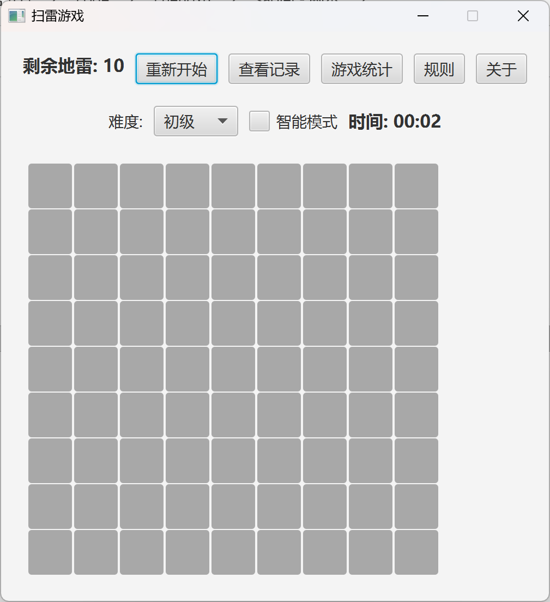

# 扫雷游戏 (MineSweeper)

一个使用 **Java + JavaFX** 开发的经典扫雷游戏，具备完整的游戏逻辑、智能模式、游戏记录与统计功能，数据通过 SQLite 本地数据库持久化。

 

## 功能特点

- **经典扫雷玩法**：左键揭开格子，右键插旗标记地雷。
- **智能模式**：点击已揭示的数字格子，若周围旗帜数等于数字，自动揭开剩余安全格子，提高游戏效率。
- **三种难度**：初级 (9×9, 10雷)、中级 (14×17, 40雷)、高级 (14×30, 80雷)。
- **实时计时**：精确到毫秒，游戏进行中动态显示。
- **游戏记录**：自动保存每局结果（胜负、用时、难度、棋盘大小、时间戳）到 SQLite 数据库。
- **统计看板**：查看历史记录、最佳成绩（获胜用时最短）、按难度分组统计。
- **友好的 UI**：按钮颜色随数字变化，旗帜、地雷表情符号直观展示。
- **规则说明 & 关于**：内置游戏规则介绍和项目信息弹窗。

## 技术栈

| 类别       | 技术                          |
| ---------- | ----------------------------- |
| 语言       | Java 17                       |
| UI 框架    | JavaFX 17                     |
| 数据库     | SQLite (sqlite-jdbc-3.44.1.0) |
| 构建工具   | Maven                         |
| 版本控制   | Git                           |

## 如何运行

### 前提条件
- JDK 11 或更高版本（推荐 JDK 17）
- Maven 3.6+ （或使用 IDE 内置 Maven）

### 步骤
1. **克隆项目**
   ```bash
   git clone https://github.com/yyx-cat/shaolei.git
   cd shaolei
2. **使用 Maven 打包**
   ```bash
   mvn clean package

3. **运行 JAR 文件**
java -jar target/shaolei-1.0-SNAPSHOT.jar
---

## 🎮 操作说明

| 操作 | 效果 |
|------|------|
| **左键点击格子** | 揭开格子，显示周围雷数 |
| **右键点击格子** | 标记/取消标记地雷（🚩） |
| **智能模式 + 左键点击数字** | 自动揭开周围安全格子 |
| **难度下拉框** | 切换初级/中级/高级 |
| **重新开始按钮** | 重置当前游戏 |

---

##  待改进

- [ ] 自定义难度设置（行列数和雷数可调）
- [ ] 添加背景音乐和音效
- [ ] 支持主题切换（浅色/深色模式）
